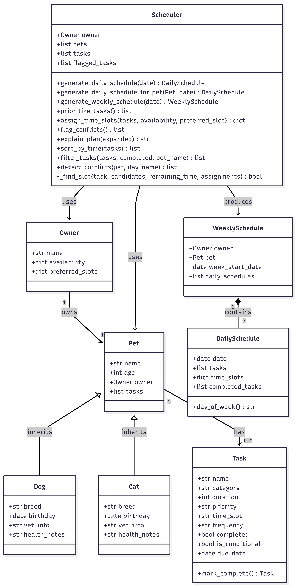
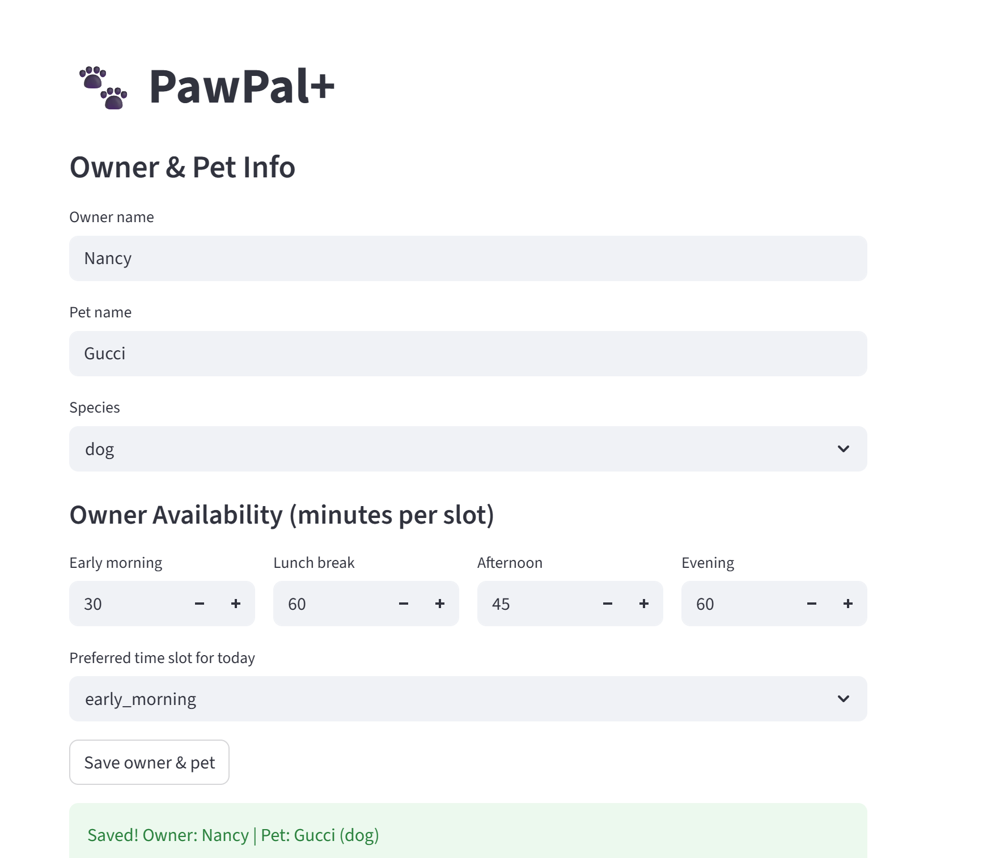
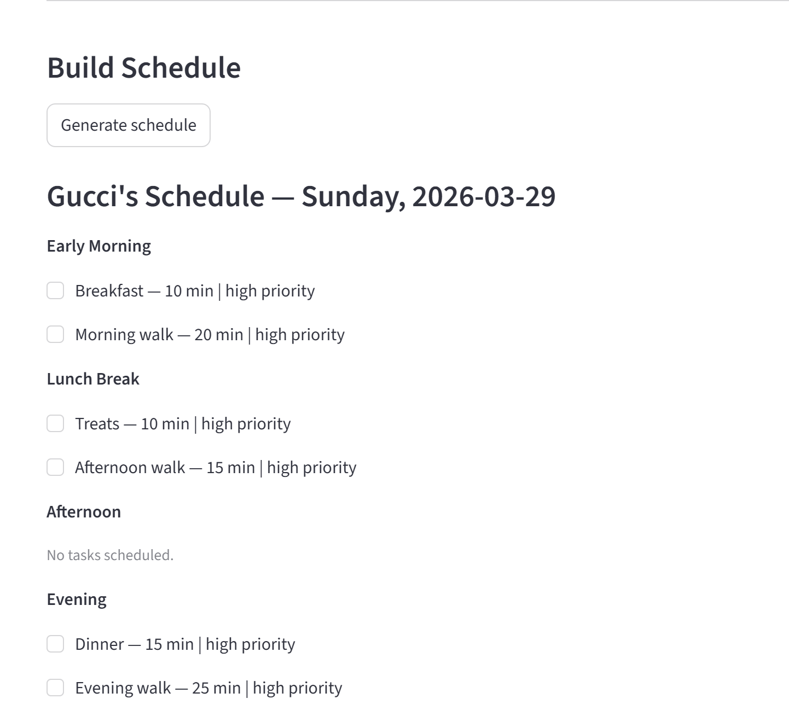
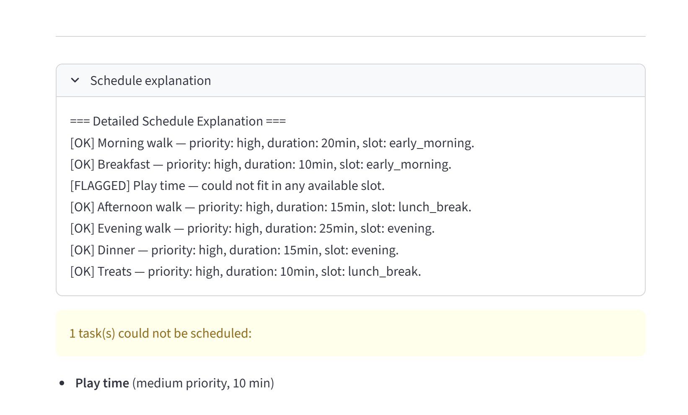

# PawPal+ (Module 2 Project)

A smart pet care management system that helps owners stay consistent with daily pet care routines.

## Scenario

A busy pet owner needs help staying consistent with pet care. They want an assistant that can:

- Track pet care tasks (walks, feeding, meds, enrichment, grooming, etc.)
- Consider constraints (time available, priority, owner preferences)
- Produce a daily plan and explain why it chose that plan

## What was built

The final app:

- Lets a user enter basic owner + pet info
- Lets a user add/edit tasks (duration + priority at minimum)
- Generates a daily schedule/plan based on constraints and priorities
- Displays the plan clearly and explains the reasoning
- Includes tests for the most important scheduling behaviors

## Getting started

### Setup

```bash
py -m venv .venv
.venv\Scripts\activate
py -m pip install -r requirements.txt
```

### Suggested workflow

1. Read the scenario carefully and identify requirements and edge cases.
2. Draft a UML diagram (classes, attributes, methods, relationships).
3. Convert UML into Python class stubs (no logic yet).
4. Implement scheduling logic in small increments.
5. Add tests to verify key behaviors.
6. Connect your logic to the Streamlit UI in `app.py`.
7. Refine UML so it matches what you actually built.

## Project structure

```
pawpal_plus/
├── pawpal_system.py   # Core backend logic (OOP classes and scheduling)
├── app.py             # Streamlit UI
├── main.py            # CLI demo script
├── conftest.py        # pytest configuration
├── requirements.txt   # Project dependencies
└── tests/
    ├── __init__.py
    └── test_pawpal.py # Automated test suite
```

## Running the app

```bash
py -m streamlit run app.py
```

## Running the CLI demo

```bash
py main.py
```

## Smarter scheduling

PawPal+ includes several intelligent scheduling features:

- **Sorting**: Tasks are sorted by natural day order (early morning → lunch break → afternoon → evening) using `sort_by_time()`
- **Filtering**: Tasks can be filtered by completion status or pet name using `filter_tasks()`
- **Recurring tasks**: Marking a daily or weekly task complete automatically generates the next occurrence using Python's `timedelta`
- **Conflict detection**: `detect_conflicts()` checks if a time slot is overbooked and returns a warning message rather than crashing

## Testing PawPal+

Run the full test suite with:

```bash
py -m pytest
```

### What the tests cover

| Test | Description |
|------|-------------|
| `test_mark_complete_once` | One-off task marked complete returns None |
| `test_add_task_increases_count` | Adding a task to a pet increases its task count |
| `test_mark_complete_daily` | Daily task generates a new task due tomorrow |
| `test_mark_complete_weekly` | Weekly task generates a new task due in 7 days |
| `test_detect_conflicts` | Slot overflow correctly flagged as a conflict |
| `test_sort_by_time` | Tasks returned in natural day order |
| `test_pet_with_no_tasks` | Pet with no tasks produces no errors or conflicts |

## System Architecture

### Initial UML Design


### Final UML Design


> Both diagrams were generated using [Mermaid](https://mermaid.live). 
> See `uml_diagrams.docx` for the full Mermaid code to recreate them.

## Demo (screen shot)





### Confidence level

⭐⭐⭐⭐ (4/5) — Core scheduling behaviors are well covered. Future improvements include tests for multi-pet scheduling and the actual vs scheduled time tracking feature.

## Dependencies

- `streamlit >= 1.30`
- `pytest >= 7.0`
