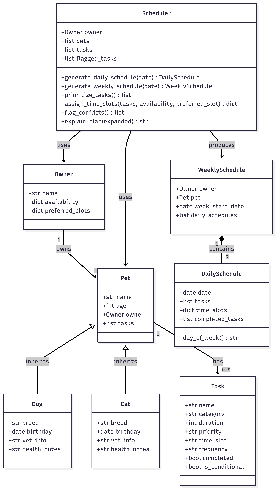
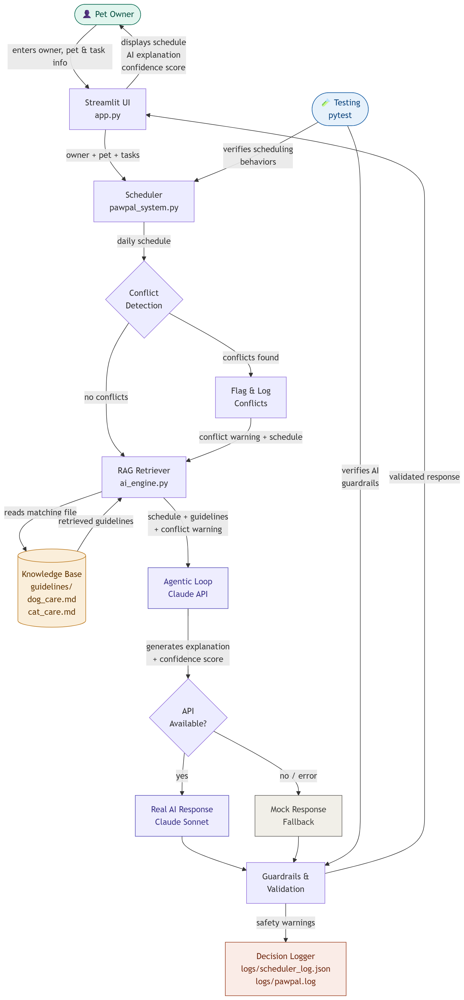
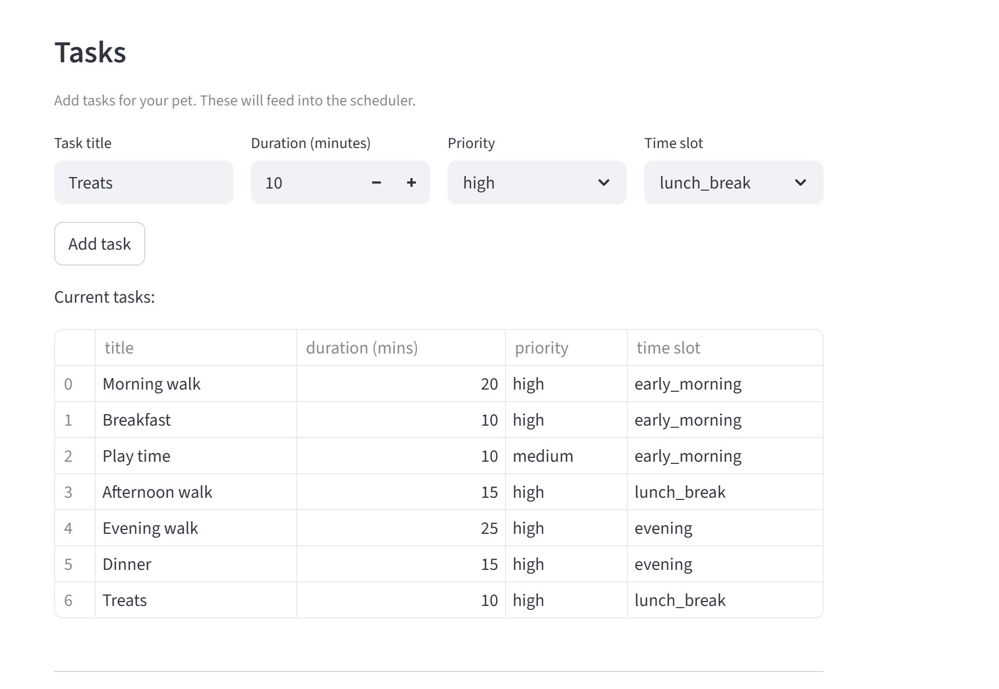
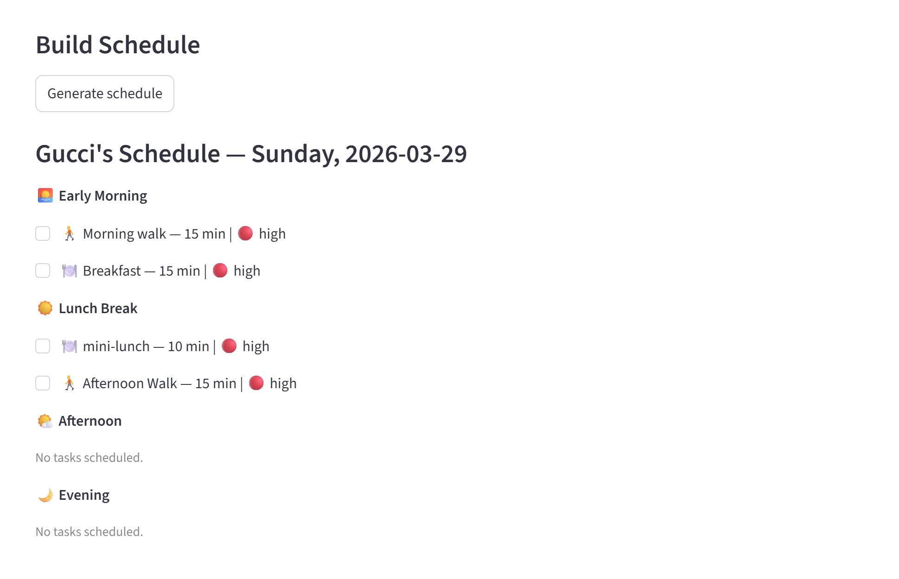
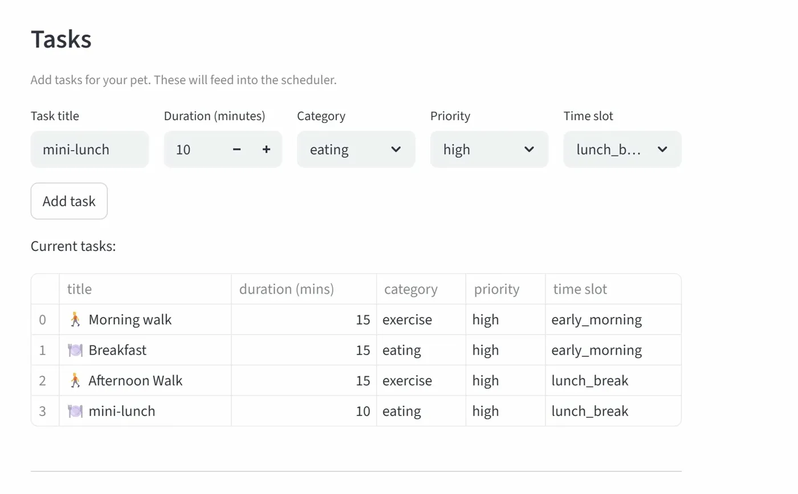

# PawPal+ AI 🐾
> A smart, AI-integrated pet care scheduling assistant built with Python, Streamlit, and the Anthropic Claude API.

---

## 📌 Original Project

PawPal+ was originally developed in Modules 1–3 as a rule-based pet care scheduling system. Its original goals were to help a busy pet owner track daily care tasks (walks, feeding, medications, enrichment, grooming) for their dog or cat, generate a prioritized daily schedule based on owner availability, and detect scheduling conflicts. The system was built using Python OOP principles with a Streamlit UI and a CLI demo script.

---

## 🐾 Scenario

A busy pet owner needs help staying consistent with pet care. They want an assistant that can:

- Track pet care tasks (walks, feeding, medications, vitamins, enrichment, grooming, etc.)
- Consider constraints (time available, priority, owner preferences)
- Produce a daily plan and explain why it chose that plan

---

## ✅ What Was Built

The final app:

- Lets a user enter basic owner + pet info including breed
- Lets a user add, edit, and delete tasks (duration, priority, category, time slot)
- Generates a daily schedule per pet based on constraints and priorities
- Displays the plan clearly with emoji indicators and priority badges
- Explains scheduling decisions using AI-powered analysis
- Retrieves breed-specific and seasonal care guidelines via RAG
- Detects and flags scheduling conflicts with AI review
- Includes tests for the most important scheduling behaviors

---

## ⚙️ Getting Started

### Prerequisites
- Python 3.13+
- An Anthropic API key with credits ([console.anthropic.com](https://console.anthropic.com))

### Setup

```bash
py -m venv .venv
.venv\Scripts\activate
py -m pip install -r requirements.txt
```

### Set your Anthropic API key (Windows)
```bash
# Permanent — recommended
# Set via System Environment Variables → User Variables → New
# Variable name: ANTHROPIC_API_KEY
# Variable value: your key

# Verify it's working
py -c "import os; print(os.environ.get('ANTHROPIC_API_KEY', 'NOT FOUND'))"
```

### Run the Streamlit app
```bash
py -m streamlit run app.py
```

### Run the CLI demo
```bash
py main.py
```

### Run the evaluation script
```bash
py evaluate.py
```

### Run the test suite
```bash
py -m pytest
```

> **Note:** If you don't have API credits, set `MOCK_MODE = True` in `ai_engine.py` to use realistic mock responses for testing.

---

## 🏗️ System Architecture

### Initial UML Design


### Final UML Design


> Both diagrams were generated using [Mermaid](https://mermaid.live).
> See `uml_diagrams.docx` for the full Mermaid code to recreate them.

### System Flow Diagram


---

## 🤖 AI Features

| Feature | What It Does |
|---------|-------------|
| 🔍 RAG | Retrieves up to 3 care guideline sources before every AI response |
| 🤖 Agentic Workflow | 4-step reasoning chain: Analyze → Propose → Validate → Explain |
| 🎨 Few-Shot Specialization | Constrains AI tone to fun and playful using curated examples |
| 🛡️ Guardrails | Safety checks for missing feeding tasks, unscheduled medications, slot overload |
| 📋 Logging | Every AI decision logged to `logs/pawpal.log` and `logs/scheduler_log.json` |

### RAG Knowledge Base
```
guidelines/
├── dog_care.md
├── cat_care.md
├── breeds/
│   ├── golden_retriever.md
│   ├── bichon_frise.md
│   ├── pomeranian.md
│   └── persian.md
└── seasonal/
    ├── spring.md
    ├── summer.md
    ├── fall.md
    └── winter.md
```

---

## 🧠 Smarter Scheduling

PawPal+ includes several intelligent scheduling features:

- **Sorting**: Tasks sorted by natural day order (early morning → lunch break → afternoon → evening)
- **Filtering**: Tasks filtered by completion status or pet name
- **Recurring tasks**: Daily/weekly tasks auto-generate next occurrence using Python's `timedelta`
- **Conflict detection**: Slot overflow flagged with warning rather than crashing
- **Per-pet schedules**: Each pet gets an independent daily schedule based on owner availability

---

## 🗂️ Project Structure

```
pawpal_plus/
├── pawpal_system.py        # Core OOP scheduling logic
├── ai_engine.py            # RAG, agentic loop, logging, guardrails
├── app.py                  # Streamlit UI
├── main.py                 # CLI demo script
├── evaluate.py             # Reliability evaluation script
├── conftest.py             # pytest configuration
├── requirements.txt        # Project dependencies
├── guidelines/
│   ├── dog_care.md
│   ├── cat_care.md
│   ├── few_shot_examples.md
│   ├── breeds/
│   └── seasonal/
├── logs/
│   ├── pawpal.log
│   └── scheduler_log.json
├── assets/
│   ├── uml_initial.png
│   ├── uml_final.png
│   ├── system_flow.png
│   └── pawpal_demo.gif
├── tests/
│   ├── __init__.py
│   └── test_pawpal.py
├── reflection.md
├── model_card.md
├── evaluation.md
└── uml_diagrams.docx
```

---

## 🧪 Testing PawPal+

Run the full test suite with:

```bash
py -m pytest
```

### What the Tests Cover

| Test | Description |
|------|-------------|
| `test_mark_complete_once` | One-off task marked complete returns None |
| `test_add_task_increases_count` | Adding a task to a pet increases its task count |
| `test_mark_complete_daily` | Daily task generates a new task due tomorrow |
| `test_mark_complete_weekly` | Weekly task generates a new task due in 7 days |
| `test_detect_conflicts` | Slot overflow correctly flagged as a conflict |
| `test_sort_by_time` | Tasks returned in natural day order |
| `test_pet_with_no_tasks` | Pet with no tasks produces no errors or conflicts |

### Evaluation Results

```
5/5 scenarios passed
Avg confidence: 4.0/5
Conflicts detected: 1 ✅
Safety warnings: 2 ✅
Logging: Active ✅
Overall: System reliable ✅
```

---

## 📸 Demo

### App Screenshots





### Live Walkthrough


> GIF shows: entering owner/pet info → adding tasks → generating schedule → AI explanation → conflict detection

---

## 💡 Sample AI Interactions

### Example 1 — Happy path (no conflicts)
**Input:** Gucci (Dog, Golden Retriever) | Breakfast, Morning walk, Vitamins in early morning
**AI Output:** 4/5 confidence | Sources: base dog guidelines + Golden Retriever breed guidelines + Spring seasonal guidelines | Suggestion: add afternoon enrichment task

### Example 2 — Conflict detected
**Input:** Same pet with 70 min of evening tasks but only 60 min available
**AI Output:** ⚠️ Conflict flagged | AI recommends spreading tasks to afternoon slot

### Example 3 — Safety guardrail triggered
**Input:** Pet with only exercise tasks, no feeding scheduled
**AI Output:** ⚠️ Safety warning: no feeding tasks scheduled today

---

## ⚖️ Ethical Considerations

- PawPal+ is a scheduling tool, it is **not** a substitute for professional veterinary advice
- Always consult a licensed veterinarian for health-related issues
- Care guidelines are based on general best practices and may not apply to every individual animal
- The system should not be used to plan care for exotic or legally prohibited animals

---

## 🔮 Future Improvements

- Actual vs allocated time tracking with weekly adjustment graph
- Pet type validation guardrail
- More breed guidelines
- Non-standard schedule support (shift work, flexible hours)
- Multi-pet weekly view in a single session
- Real API activation (`MOCK_MODE = False`) once credits are available

---

## ⭐ Confidence Level

⭐⭐⭐⭐ (4/5) — Core scheduling and AI behaviors are well covered. Remaining gap is the actual vs allocated time tracking feature and real API integration.

---

## 📦 Dependencies

```
streamlit >= 1.30
pytest >= 7.0
tabulate >= 0.9
anthropic >= 0.25
```

---

## 👤 Author

Built as part of the AI110 Module 2–4 capstone project.